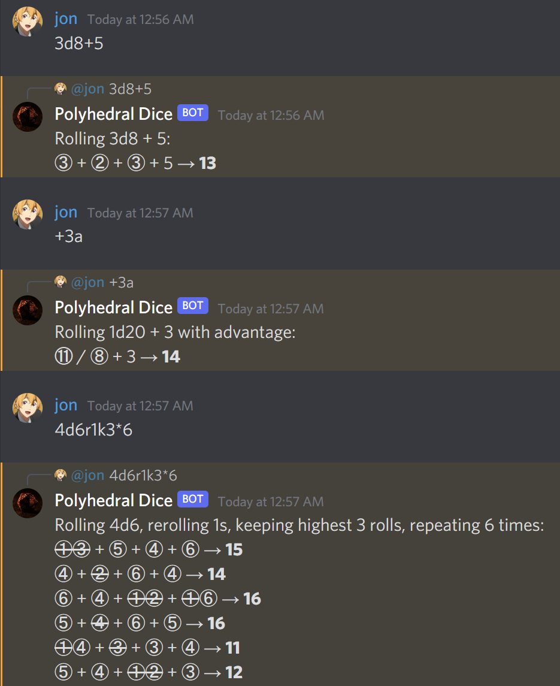

# Dicebot
[](https://github.com/jmoore34/dicebot "Go to GitHub repo")
[](https://github.com/jmoore34/dicebot/releases/)

A Rust-based dice rolling bot for Discord

## Features
* **Performant** - Written in Rust, fast and memory efficient on every major platform
* **Concise** - Convenient shorthands such as `+3a` for when you don't want to type out `1d20+3 advantage`
* **Expressive** - Support for advanced queries such as `4d6r1k3*6`

## Screenshots


## Usage

Use [this OAuth link](https://discord.com/api/oauth2/authorize?client_id=938159771851305020&permissions=274877910080&scope=bot) to invite the bot to your server, or host it yourself:

### Self-hosting

1. Obtain a [bot token](https://discordpy.readthedocs.io/en/stable/discord.html).

2. Download and run the bot executable from the [Releases](https://github.com/jmoore34/dicebot/releases/) page. This should generate an empty `BOT_TOKEN.txt` file.

3. Place your bot token in the `BOT_TOKEN.txt` file or in the `BOT_TOKEN` environmental variable.

4. Re-start the bot executable.

5. [Invite your bot](https://discordpy.readthedocs.io/en/stable/discord.html#inviting-your-bot) to your server.

### Hosting on Heroku

1. Clone the and cd to the repository
```bash
git clone https://github.com/jmoore34/dicebot.git
cd dicebot
```

2. Create a Heroku account and create a new app.

3. Install the [Heroku CLI](https://devcenter.heroku.com/articles/heroku-cli) and run `heroku login`.
   
4. Go into the settings. Add a new config var setting BOT_TOKEN to your bot token (see "self-hosting" section above).

5. Deploy the app:
```bash
heroku buildpacks:set emk/rust
heroku git:remote -a "the name of your app"
git push heroku master
```

6. Go into `Resources` and ensure the worker dyno is enabled.